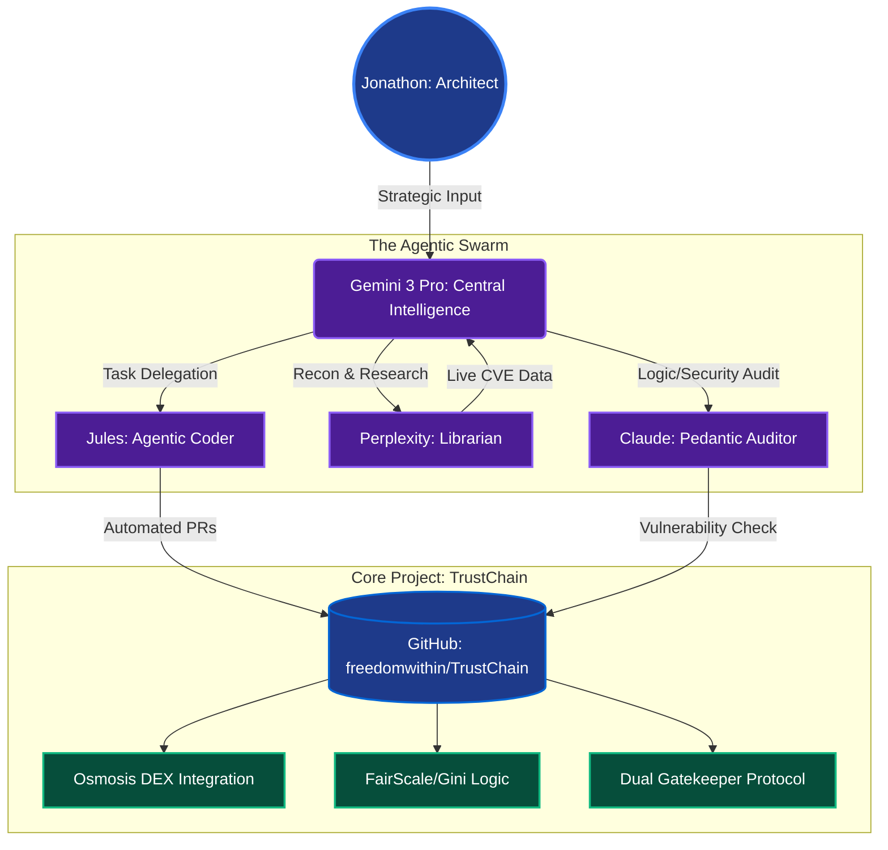

<div align="center">

# TrustChain-Sovereign: Frontend
### Institutional-Grade Monitoring HUD for the Solana Behavioral Firewall

**Live Demo:** [Watch the Full System Demo on Vimeo](https://vimeo.com/1167869054)  
**Live Frontend:** [trustchain-sovereign-frontend.vercel.app](https://trustchain-sovereign-frontend.vercel.app)  
**Backend Repo:** [trustchain-sovereign-backend.vercel.app](https://trustchain-sovereign-backend.vercel.app)  
**Project Status:** Institutional Hardening (Production-Ready)  
**Build Version:** 2.1.5-Sovereign (Hardened)

</div>

---

## What This Is

This repository contains the **frontend only**: the React 18 / Vite / TailwindCSS institutional monitoring HUD that surfaces TrustChain-Sovereign's real-time behavioral integrity signals.

The UI was purpose-built to feel like a security operations terminal — not a consumer dashboard. Every component reflects a live signal from the decoupled backend: Gini/HHI scores, FairScale reputation tiers, Temporal Sentinel alerts, and on-chain notarization events are all rendered in real time.

> The backend (Node.js/TypeScript Express, Integrity Engine, Anchor Notary Bridge) lives in a separate repository as part of the decoupled V2.1 infrastructure.

---

## FairScale Integration — Visual Layer

The frontend surfaces the FairScale weighted score as a **named, visible component** of every wallet evaluation — not a hidden backend calculation. The UI renders:

- The raw **FairScale Social Score** alongside the **TrustChain Behavioral Score**
- The **Total Integrity Score** derived from the weighted formula:

```
TotalIntegrityScore = (TrustChainBehavioral × 0.7) + (FairScaleSocial × 0.3)
```

This makes the FairScale contribution auditable at a glance. A judge, protocol partner, or user can see exactly how much social reputation is influencing the final verdict — and verify that behavioral signals cannot be overridden by a high FairScore alone.

---

## Reputation Status Display

The HUD maps wallet states to a clear visual hierarchy:

| Status | Color | Trigger Condition |
|---|---|---|
| **PROBATIONARY** | Yellow | 0–2 transactions or unverified FairScore |
| **VERIFIED** | Cyan | 3+ transactions, behavioral maturity confirmed |
| **ELITE_VERIFIED** | Blue | Weighted score ≥ 85 (behavioral + FairScale) |
| **SYBIL / ALERT** | Red | Temporal Sentinel detects high-churn or one-block LP pattern |

Status transitions are rendered live as backend data updates — the UI does not cache or lag state.

---

## Frontend Enhancements (Sovereign V2.1)

The V2.1 Sovereign update transitioned the interface from a diagnostic panel to a full institutional-grade monitoring HUD. The following features were implemented:

### 1. Technical HUD Layout
The interface uses a **left-aligned HUD architecture**: system logs, status readouts, and Sentinel alerts are anchored to the left margin, keeping the central Pool Cards unobstructed. The layout is designed to read like a command center, not a web app.

All system messages use a **typewriter-by-character reveal effect** — terminal-style text animation that makes the Behavioral Engine analysis feel live and computational rather than static.

### 2. Institutional Monitoring Components

**Pool Integrity Badges** — each Solana Liquidity Pool card displays a real-time risk badge ("Low / Medium / High") driven by live Gini/HHI signals from the backend. These update as the backend's integrity engine processes new transaction data.

**Temporal Sync Monitor** — a dedicated UI element visualizes the 2,000ms sliding window used by the Temporal Sentinel. During high-frequency burst detection, the monitor enters an "Active Warning" state with pulsing red borders to communicate urgency without interrupting the data flow.

**Notarization Toasts** — success and failure notifications fire specifically when the Anchor Notary Bridge commits an integrity score to a Solana PDA. These toasts confirm the on-chain write event and display the PDA address for verification.

### 3. Interactive Simulation & Transparency Tools

**Hydration Reactor** — the UI is wired to react to the `hydrate.cjs` behavioral simulation script. As the script processes transactions in the background terminal, the HUD displays live "jumps" in Gini/HHI scores, showing the Sentinel and scoring engine responding in real time. This was built specifically to make the demo auditable — viewers can watch scores change as data flows in rather than seeing a static result.

**Transparent Terminal Overlay** — a stylized terminal container (bottom-left of the HUD) surfaces raw JSON logs and RPC responses. This proves the data displayed is live backend output, not hardcoded demo values.

### 4. Performance & Security

**Vite Environment Hardening** — all backend communication routes through `VITE_API_BASE_URL`, enforcing strict `VITE_` prefixing to ensure environment variables are never accidentally leaked to the client bundle.

**Exponential Backoff UI** — the frontend mirrors the backend's retry logic with visual feedback during network congestion. Rather than hanging or showing a stale state, the Temporal Sentinel component enters a graceful "Reconnecting" display during backend retry cycles.

**Race Condition Prevention** — all rapid-state UI components (Sentinel alerts, status badges) use functional state updaters (`prev => !prev`) to eliminate race conditions during high-frequency updates.

---

## SDK Integration

The frontend consumes backend signals via the `@trustchain/web3-react` SDK:

```js
import { useTrustChain } from '@trustchain/web3-react';

const { status, gini, syncIndex, totalScore } = useTrustChain(walletAddress);
```

The `useTrustChain()` hook returns `status`, `gini`, `syncIndex`, and `totalIntegrityScore` in a single call, abstracting all backend communication and caching logic from the component layer.

---

## Tech Stack

| Layer | Technology |
|---|---|
| Framework | React 18 |
| Build Tool | Vite |
| Styling | TailwindCSS |
| Wallet | Phantom / Solflare Integration |
| SDK | `@trustchain/web3-react` — `useTrustChain()` hook |
| Deployment | Vercel (Production) |

---

## Local Setup

```bash
# Clone the frontend repo
git clone https://github.com/freedomwithin/trustchain-sovereign-frontend

cd trustchain-sovereign-frontend
npm install

# Configure environment
cp .env.example .env
# Set VITE_API_BASE_URL=https://trustchain-sovereign-backend.vercel.app

npm run dev
```

Frontend runs at `http://localhost:5173` and connects to the production backend by default.

---

## High-Velocity Agentic Workflow
This repository is managed by an **Agentic Swarm**, enabling enterprise-grade development velocity:
- **Architect:** Jonathon (Human)
- **Agentic Coder:** Jules (Gemini 3 Pro)
- **Logic Auditor:** Claude (Security Audit)



The V2.1 frontend enhancements were primarily delivered by **Jules (Gemini Agentic Coder)**, covering the HUD layout, typewriter effects, Temporal Sync Monitor, and Notarization Toasts. Security and state hygiene review was handled by **Claude (Logic Auditor)**.

---

**Architect:** Jonathon | Freedomwithin  
**Frontend:** [trustchain-sovereign-frontend.vercel.app](https://trustchain-sovereign-frontend.vercel.app)  
**Contact:** [X / Twitter @TrustChainDev](https://x.com/TrustChainDev/)
